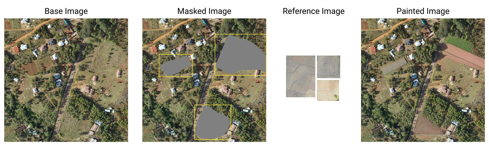

# Tackling Few-Shot Segmentation in Remote Sensing via Inpainting Diffusion Model

**ICLR Machine Learning for Remote Sensing Workshop, 2025 (Best Paper Award)**


This repo contains the official code for training and generation for the paper "Tackling Few-Shot Segmentation in Remote Sensing via Inpainting Diffusion Model".


<!-- [-Space-yellow)](https://huggingface.co/spaces/prs-eth/marigold-lcm) -->
[](https://steveimmanuel.github.io/rs-paint)
[](https://arxiv.org/abs/2503.03785)
[](https://www.apache.org/licenses/LICENSE-2.0)

[Steve Andreas Immanuel](https://steveimm.id) | [Woojin Cho](https://woojin-cho.github.io/) | [Junhyuk Heo](https://rokmc1250.github.io/) | [Darongsae Kwon](https://www.linkedin.com/in/darongsaekwon).

We introduce a image-conditioned diffusion-based approach for to create diverse set of novel-classes samples for semantic segmentation in few-shot settings in remote sensing domain. By ensuring semantic consistency using cosine similarity between the generated samples and the conditioning image, and using the Segment Anything Model (SAM) to obtain the precise segmentation, our method can train off-the-shelf segmentation models with high-quality synthetic data, significantly improving performance in low-data scenarios.



## Setup

Create a new conda environment and activate it with the following commands:
```
conda env create -f environment.yaml
conda activate rspaint
```

## Checkpoint Weights
All required checkpoints are available in [huggingface](https://huggingface.co/SteveImmanuel/RSPaint). 

Download `sd_inpaint_samrs_ep74.ckpt` and `remoteclip.pt` and save them to the `checkpoints` directory. Optionally, if you also want to perform the mask refinement, download SAM checkpoint and also save it to the `checkpoints` directory.

## Generating Samples

>Note that the current version is not optimized. Generating a single sample with a resolution of 512x512 takes about 9GB of GPU memory. Using cpu is possible, but takes significantly longer.

Follow along the steps in the provided notebook [`notebooks/generate_samples.ipynb`](notebooks/generate_samples.ipynb) to generate samples using the trained model.

## Training

### Data preparing
To train the model, you can use any dataset with bounding box annotations.

The data structure must be like this:
```
.
├── bbox
│   ├── train
│   │   ├── 00001.txt
│   │   ├── 00003.txt
│   │   ├── 00004.txt
│   │   ├── ...
│   └── validation
│   │   ├── 00023.txt
│   │   ├── 00024.txt
│   │   ├── 00025.txt
│   │   ├── ...
└── images
    ├── train
│   │   ├── 00001.png
│   │   ├── 00003.png
│   │   ├── 00004.png
│   │   ├── ...
│   └── validation
│   │   ├── 00023.png
│   │   ├── 00024.png
│   │   ├── 00025.png
│   │   ├── ...
```
Update the `yaml` config file in the following lines:
```yaml
data:
  target: main.DataModuleFromConfig
  params:
      batch_size: 8
      wrap: False
      train:
          target: ldm.data.remote_sensing.RemoteSensingDataset
          params:
              state: train
              dataset_dir: <root dataset directory>
              arbitrary_mask_percent: 0.5
              image_size: 512
              version: openai/clip-vit-large-patch14
              bbox_ratio_range: [0.1, 0.25]
      validation:
          target: ldm.data.remote_sensing.RemoteSensingDataset
          params:
              state: validation
              dataset_dir: <root dataset directory> 
              arbitrary_mask_percent: 0.5
              image_size: 512
              version: openai/clip-vit-large-patch14
              bbox_ratio_range: [0.1, 0.25]
```
Optionally, you can write custom dataloader and placing it in `ldm/data` directory. Then, change the `target` key to the custom dataloader.

To start training, use the following command:
```
python -u main.py \
--logdir <log path> --pretrained_model checkpoints/checkpoints/sd_inpaint_samrs_ep74.ckpt \
--base <yaml config path> --scale_lr False --seed 20250110
```

## Citation
```
@article{2025rspaint,
  title={Tackling Few-Shot Segmentation in Remote Sensing via Inpainting Diffusion Model},
  author={Immanuel, Steve Andreas and Cho, Woojin and Heo, Junhyuk and Kwon, Darongsae},
  journal={arXiv preprint arXiv:2503.03785},
  year={2025}
}
```

## Acknowledgements
This code is mainly based on [Paint by Example](https://github.com/Fantasy-Studio/Paint-by-Example). We thank the authors for their great work.
